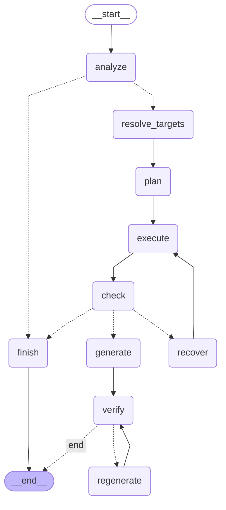

# Agent graph (generated)

Generated from the code by `scripts/export_agent_graph.py`; do not edit by hand.
Dashed arrows are conditional edges (decisions).

```mermaid
---
config:
  flowchart:
    curve: linear
---
graph TD;
	__start__([<p>__start__</p>]):::first
	analyze(analyze)
	resolve_targets(resolve_targets)
	plan(plan)
	execute(execute)
	check(check)
	recover(recover)
	generate(generate)
	finish(finish)
	verify(verify)
	regenerate(regenerate)
	__end__([<p>__end__</p>]):::last
	__start__ --> analyze;
	analyze -.-> finish;
	analyze -.-> resolve_targets;
	check -.-> finish;
	check -.-> generate;
	check -.-> recover;
	execute --> check;
	generate --> verify;
	plan --> execute;
	recover --> execute;
	regenerate --> verify;
	resolve_targets --> plan;
	verify -. &nbsp;end&nbsp; .-> __end__;
	verify -.-> regenerate;
	finish --> __end__;
	classDef default fill:#f2f0ff,line-height:1.2
	classDef first fill-opacity:0
	classDef last fill:#bfb6fc
```
